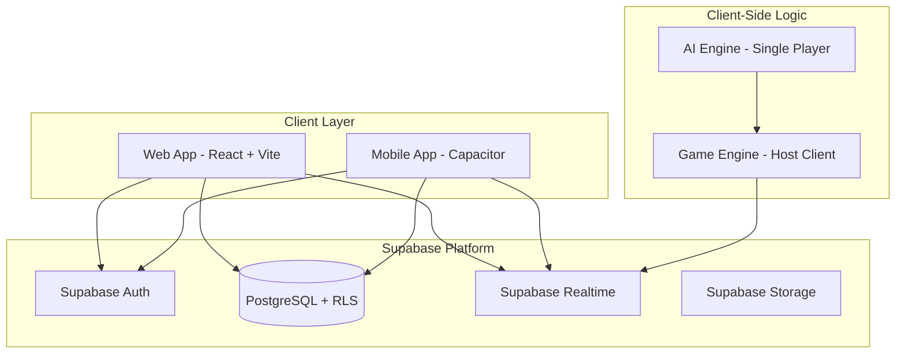
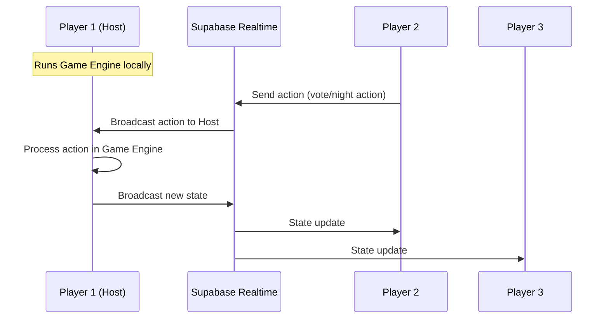
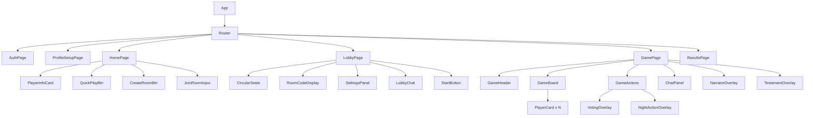
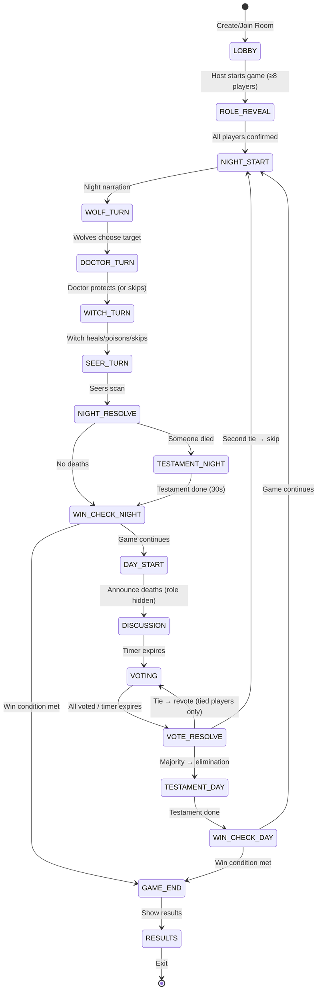

# Dokumen Desain - GGS (Ganteng Ganteng Serigala) — Red vs Blue Edition

## Ikhtisar

GGS adalah permainan deduksi sosial werewolf edisi Red vs Blue yang dibangun dengan arsitektur monorepo (Turborepo + pnpm). Frontend React + TypeScript + Vite, backend Supabase (Auth, PostgreSQL, Realtime), dibungkus Capacitor untuk mobile.

Dokumen ini mendeskripsikan arsitektur teknis untuk implementasi Red vs Blue Edition dengan Supabase sebagai backend utama.

---

## 1. Arsitektur Tingkat Tinggi

### 1.1 Diagram Sistem




### 1.2 Struktur Monorepo

```
ggs/
├── apps/
│   ├── web/                    # React + Vite frontend
│   │   ├── public/avatars/     # 7 avatar images
│   │   ├── src/
│   │   │   ├── components/     # UI components
│   │   │   ├── hooks/          # Custom hooks
│   │   │   ├── lib/            # Supabase client, utilities
│   │   │   ├── pages/          # Route pages
│   │   │   ├── stores/         # Zustand stores
│   │   │   └── styles/         # CSS & themes
│   │   └── .env                # Supabase credentials
│   └── (mobile via Capacitor)
├── packages/
│   ├── game-engine/            # Core game logic (Red vs Blue)
│   ├── shared-types/           # TypeScript interfaces & types
│   ├── ai-engine/              # Bot AI logic
│   └── config/                 # Shared configurations
├── turbo.json
├── pnpm-workspace.yaml
└── package.json
```

### 1.3 Multiplayer Model: Host-Authoritative



**Catatan:** Host client menjalankan game engine. Semua pemain lain mengirim actions via Supabase Realtime channel, host memproses dan broadcast state baru. Model ini dipilih karena:
- Tidak perlu dedicated server
- Supabase Realtime cukup untuk relay messages
- Game logic tetap di shared package (bisa dipindah ke server nanti)

---

## 2. Desain Frontend

### 2.1 Halaman dan Routes

| Route | Halaman | Deskripsi |
|-------|---------|-----------|
| `/auth` | AuthPage | Login/Register tabs, guest button |
| `/profile/setup` | ProfileSetupPage | Avatar picker (7 images) + display name |
| `/` | HomePage | Player card, Quick Play, Create Room, Join Room, Friends |
| `/lobby/:roomId` | LobbyPage | Circular seats, room code, settings, chat |
| `/game/:sessionId` | GamePage | Main game screen |
| `/results/:sessionId` | ResultsPage | Win/lose, role reveal, stats |

### 2.2 Component Tree




### 2.3 State Management (Zustand)

```typescript
// Auth Store
interface AuthStore {
  user: User | null;
  profile: Profile | null;
  session: Session | null;
  loading: boolean;
  login: (email: string, password: string) => Promise<void>;
  signup: (email: string, password: string, displayName: string) => Promise<void>;
  loginAsGuest: () => Promise<void>;
  logout: () => Promise<void>;
  fetchProfile: () => Promise<void>;
}

// Game Store
interface GameStore {
  // Session State
  session: GameSession | null;
  phase: GamePhase;
  round: number;

  // Player State
  players: Player[];
  currentPlayer: Player | null;
  myRole: Role | null;
  myTeam: Team | null;

  // Night Info (role-specific)
  knownWerewolves: string[];    // For WW and Witch
  knownSeer: string | null;     // For Seer (knows other Seer)
  seerResults: Record<string, Team>; // Seer scan results

  // Voting State
  votes: Record<string, string>;
  votingOpen: boolean;

  // Testament State
  currentTestament: { playerId: string; message: string } | null;
  testamentTimer: number;

  // Chat State
  messages: ChatMessage[];

  // Timer State
  timeRemaining: number;
  timerActive: boolean;

  // UI State
  narratorText: string;
  isNarratorVisible: boolean;

  // Actions
  submitNightAction: (targetId: string) => void;
  submitWitchAction: (action: WitchAction) => void;
  submitVote: (targetId: string) => void;
  submitTestament: (message: string) => void;
  sendMessage: (text: string) => void;
}

// Settings Store
interface SettingsStore {
  musicVolume: number;
  sfxVolume: number;
  reducedMotion: boolean;
  fontSize: number;
}
```

### 2.4 Visual Design System

```css
/* Color Palette */
:root {
  --bg-primary: #0a1628;        /* Deep navy night sky */
  --bg-surface: #1a2744;        /* Card backgrounds */
  --bg-elevated: #243352;       /* Hover/active states */
  --color-primary: #f59e0b;     /* Amber/gold - buttons, accents */
  --color-primary-hover: #d97706;
  --color-red-team: #ef4444;    /* Red team accents */
  --color-blue-team: #3b82f6;   /* Blue team accents */
  --color-secondary: #7c3aed;   /* Purple - special elements */
  --color-text: #eaeaea;
  --color-text-muted: #8892a4;
  --color-border: #2d3f5c;
  --color-success: #10b981;
  --color-error: #ef4444;
  --color-night: #1e1b4b;       /* Deep purple for night phases */
  --radius-md: 12px;
  --radius-lg: 16px;
}
```

**UI Style:**
- Rounded corners (12-16px)
- Subtle borders (1px solid var(--color-border))
- Glow effects on buttons (box-shadow with primary color)
- Background: dark gradient with subtle forest silhouette
- Buttons: golden gradient with wooden frame feel
- Cards: semi-transparent dark with border glow
- Direct click interaction (no confirmation popups)

---

## 3. Desain Backend (Supabase)

### 3.1 Supabase Services Used

| Service | Penggunaan |
|---------|-----------|
| **Auth** | Email/password login, guest (anonymous), session management |
| **PostgreSQL** | Profiles, game_rooms, room_players |
| **Realtime** | Game state broadcast, presence (lobby), room updates |
| **RLS** | Row-level security policies per table |

### 3.2 Database Schema

```sql
-- Profiles
CREATE TABLE profiles (
  id UUID PRIMARY KEY DEFAULT gen_random_uuid(),
  user_id UUID REFERENCES auth.users(id) ON DELETE CASCADE UNIQUE NOT NULL,
  display_name TEXT NOT NULL,
  avatar_id INTEGER NOT NULL DEFAULT 1 CHECK (avatar_id BETWEEN 1 AND 7),
  coins INTEGER DEFAULT 100,
  level INTEGER DEFAULT 1,
  xp INTEGER DEFAULT 0,
  games_played INTEGER DEFAULT 0,
  games_won INTEGER DEFAULT 0,
  created_at TIMESTAMPTZ DEFAULT now(),
  updated_at TIMESTAMPTZ DEFAULT now()
);

-- Game Rooms
CREATE TABLE game_rooms (
  id UUID PRIMARY KEY DEFAULT gen_random_uuid(),
  code VARCHAR(6) UNIQUE NOT NULL,
  host_id UUID REFERENCES auth.users(id) NOT NULL,
  status VARCHAR(20) DEFAULT 'waiting' CHECK (status IN ('waiting', 'playing', 'finished')),
  config JSONB NOT NULL DEFAULT '{}',
  max_players INTEGER DEFAULT 8 CHECK (max_players BETWEEN 8 AND 16),
  current_players INTEGER DEFAULT 0,
  created_at TIMESTAMPTZ DEFAULT now(),
  updated_at TIMESTAMPTZ DEFAULT now()
);

-- Room Players
CREATE TABLE room_players (
  id UUID PRIMARY KEY DEFAULT gen_random_uuid(),
  room_id UUID REFERENCES game_rooms(id) ON DELETE CASCADE NOT NULL,
  user_id UUID REFERENCES auth.users(id) ON DELETE CASCADE NOT NULL,
  slot INTEGER NOT NULL,
  is_ready BOOLEAN DEFAULT false,
  joined_at TIMESTAMPTZ DEFAULT now(),
  UNIQUE(room_id, user_id),
  UNIQUE(room_id, slot)
);
```

### 3.3 RLS Policies

```sql
-- Profiles: public read, own write
CREATE POLICY "Public profiles" ON profiles FOR SELECT USING (true);
CREATE POLICY "Own profile insert" ON profiles FOR INSERT WITH CHECK (auth.uid() = user_id);
CREATE POLICY "Own profile update" ON profiles FOR UPDATE USING (auth.uid() = user_id);

-- Rooms: public read, auth create, host manage
CREATE POLICY "Public rooms" ON game_rooms FOR SELECT USING (true);
CREATE POLICY "Auth create rooms" ON game_rooms FOR INSERT WITH CHECK (auth.uid() = host_id);
CREATE POLICY "Host updates room" ON game_rooms FOR UPDATE USING (auth.uid() = host_id);
CREATE POLICY "Host deletes room" ON game_rooms FOR DELETE USING (auth.uid() = host_id);

-- Room Players: public read, own manage
CREATE POLICY "Public room players" ON room_players FOR SELECT USING (true);
CREATE POLICY "Auth join room" ON room_players FOR INSERT WITH CHECK (auth.uid() = user_id);
CREATE POLICY "Own leave room" ON room_players FOR DELETE USING (auth.uid() = user_id);
CREATE POLICY "Own update ready" ON room_players FOR UPDATE USING (auth.uid() = user_id);
```

### 3.4 Realtime Channel Design

```typescript
// Room channel — lobby presence & room updates
const roomChannel = supabase.channel(`room:${roomCode}`)
  .on('presence', { event: 'sync' }, () => { /* update player list */ })
  .on('presence', { event: 'join' }, ({ newPresences }) => { /* player joined */ })
  .on('presence', { event: 'leave' }, ({ leftPresences }) => { /* player left */ })
  .subscribe();

// Game channel — game state broadcast
const gameChannel = supabase.channel(`game:${roomId}`)
  .on('broadcast', { event: 'state_update' }, ({ payload }) => { /* update game state */ })
  .on('broadcast', { event: 'action' }, ({ payload }) => { /* host receives action */ })
  .on('broadcast', { event: 'chat' }, ({ payload }) => { /* new chat message */ })
  .subscribe();

// Host broadcasts state:
gameChannel.send({
  type: 'broadcast',
  event: 'state_update',
  payload: { gameState: filteredStateForPlayer }
});

// Player sends action:
gameChannel.send({
  type: 'broadcast',
  event: 'action',
  payload: { type: 'vote', playerId, targetId }
});
```


---

## 4. Desain Game Engine (Red vs Blue)

### 4.1 State Machine



### 4.2 Type Definitions

```typescript
// Teams
type Team = 'red' | 'blue';

// Roles
type Role = 'villager' | 'werewolf' | 'seer' | 'doctor' | 'witch';

// Phase types
type GamePhase =
  | 'LOBBY'
  | 'ROLE_REVEAL'
  | 'NIGHT_START'
  | 'WOLF_TURN'
  | 'DOCTOR_TURN'
  | 'WITCH_TURN'
  | 'SEER_TURN'
  | 'NIGHT_RESOLVE'
  | 'TESTAMENT'
  | 'DAY_START'
  | 'DISCUSSION'
  | 'VOTING'
  | 'VOTE_RESOLVE'
  | 'GAME_END'
  | 'RESULTS';

// Player state
interface PlayerState {
  id: string;
  name: string;
  avatarId: number;
  role: Role;
  team: Team;
  isAlive: boolean;
  isBot: boolean;
  botDifficulty?: 'easy' | 'medium' | 'hard';
  isConnected: boolean;
}

// Game state
interface GameState {
  id: string;
  roomId: string;
  phase: GamePhase;
  round: number;
  config: GameConfig;
  players: PlayerState[];
  nightActions: NightActions;
  votes: VoteRecord;
  eliminationHistory: EliminationEvent[];
  winner: Team | null;
  timerDeadline: number | null;

  // Witch tracking
  witchHealUsed: boolean;
  witchPoisonUsed: boolean;

  // Doctor tracking
  doctorProtectsRemaining: number;  // starts at 3
  doctorLastTarget: string | null;  // cannot protect same consecutively

  // Testament
  pendingTestament: { playerId: string; deadline: number } | null;
}

// Night actions
interface NightActions {
  wolfTarget: string | null;
  doctorTarget: string | null;
  witchAction: WitchAction | null;
  seerTargets: Record<string, string>;  // seerPlayerId → targetPlayerId
}

type WitchAction =
  | { type: 'heal' }           // heal wolf's target (1x per game)
  | { type: 'poison'; target: string }  // poison someone (1x per game)
  | { type: 'skip' };

// Vote record
interface VoteRecord {
  votes: Record<string, string>;  // voterId → targetId
  round: number;
  isRetry: boolean;
  tiedPlayers?: string[];
}

// Game config
interface GameConfig {
  maxPlayers: number;         // 8-16
  roles: RoleComposition;
  timerDuration: {
    discussion: number;       // default 120s
    voting: number;           // default 30s
    nightAction: number;      // default 20s
    testament: number;        // default 30s
  };
  mode: 'online' | 'single_player';
  hostId: string;
}

interface RoleComposition {
  werewolf: number;
  witch: number;    // always 1
  seer: number;     // always 2
  doctor: number;   // always 1
  villager: number; // remainder
}
```

### 4.3 Role Compositions (8-16 players)

```typescript
const ROLE_COMPOSITIONS: Record<number, RoleComposition> = {
  8:  { werewolf: 2, seer: 2, doctor: 1, witch: 1, villager: 2 },
  9:  { werewolf: 2, seer: 2, doctor: 1, witch: 1, villager: 3 },
  10: { werewolf: 3, seer: 2, doctor: 1, witch: 1, villager: 3 },
  11: { werewolf: 3, seer: 2, doctor: 1, witch: 1, villager: 4 },
  12: { werewolf: 4, seer: 2, doctor: 1, witch: 1, villager: 4 },
  13: { werewolf: 4, seer: 2, doctor: 1, witch: 1, villager: 5 },
  14: { werewolf: 4, seer: 2, doctor: 1, witch: 1, villager: 6 },
  15: { werewolf: 4, seer: 2, doctor: 1, witch: 1, villager: 7 },
  16: { werewolf: 4, seer: 2, doctor: 1, witch: 1, villager: 8 },
};

// Team assignment
function getTeam(role: Role): Team {
  return (role === 'werewolf' || role === 'witch') ? 'red' : 'blue';
}
```

### 4.4 Win Condition

```typescript
function checkWinCondition(players: PlayerState[]): { winner: Team; reason: string } | null {
  const alivePlayers = players.filter(p => p.isAlive);
  const aliveWerewolves = alivePlayers.filter(p => p.role === 'werewolf');
  const aliveBlueTeam = alivePlayers.filter(p => p.team === 'blue');

  // Blue wins: all werewolves eliminated
  if (aliveWerewolves.length === 0) {
    return { winner: 'blue', reason: 'Semua Werewolf telah dieliminasi!' };
  }

  // Red wins: werewolves >= blue team members
  if (aliveWerewolves.length >= aliveBlueTeam.length) {
    return { winner: 'red', reason: 'Werewolf mendominasi!' };
  }

  return null; // Game continues
}
```

**Catatan penting:** Win condition hanya menghitung **Werewolf** (bukan seluruh Red Team) vs **Blue Team**. Witch yang hidup tidak dihitung dalam perbandingan win condition meskipun dia Red Team.

### 4.5 Night Resolution Logic

```typescript
function resolveNight(state: GameState): GameState {
  const { nightActions, players } = state;
  let deaths: string[] = [];
  let saved = false;

  // 1. Wolf attack
  const wolfTarget = nightActions.wolfTarget;

  // 2. Doctor protection
  if (wolfTarget && nightActions.doctorTarget === wolfTarget) {
    saved = true; // Doctor saved the wolf's target
  }

  // 3. Witch action
  if (nightActions.witchAction) {
    if (nightActions.witchAction.type === 'heal' && wolfTarget && !saved) {
      saved = true; // Witch healed the wolf's target
    }
    if (nightActions.witchAction.type === 'poison') {
      deaths.push(nightActions.witchAction.target);
    }
  }

  // 4. Final wolf kill
  if (wolfTarget && !saved) {
    deaths.push(wolfTarget);
  }

  // Apply deaths
  const updatedPlayers = players.map(p =>
    deaths.includes(p.id) ? { ...p, isAlive: false } : p
  );

  return { ...state, players: updatedPlayers };
}
```

### 4.6 Key Engine Methods

```typescript
class GameEngine {
  // Night actions
  static submitNightAction(state: GameState, playerId: string, targetId: string): GameState;
  static submitWitchAction(state: GameState, playerId: string, action: WitchAction): GameState;
  static doctorSkip(state: GameState, playerId: string): GameState;

  // Voting
  static submitVote(state: GameState, voterId: string, targetId: string): GameState;
  static resolveVotes(state: GameState): GameState;

  // Testament
  static submitTestament(state: GameState, playerId: string, message: string): GameState;
  static advanceFromTestament(state: GameState): GameState;

  // Phase management
  static advancePhase(state: GameState): GameState;
  static startGame(state: GameState): GameState;
}
```

### 4.7 Information Visibility Rules

| Pemain | Tahu siapa |
|--------|-----------|
| Werewolf | Semua Werewolf lain |
| Witch | Semua Werewolf (tapi WW tidak tahu Witch) |
| Seer | Seer lainnya (2 Seer saling tahu) |
| Doctor | Tidak tahu siapa-siapa |
| Villager | Tidak tahu siapa-siapa |

```typescript
function filterStateForPlayer(fullState: GameState, playerId: string): ClientGameState {
  const player = fullState.players.find(p => p.id === playerId)!;

  return {
    ...fullState,
    players: fullState.players.map(p => ({
      ...p,
      role: getVisibleRole(player, p, fullState),
      team: getVisibleTeam(player, p, fullState),
    })),
    nightActions: filterNightActionsForRole(fullState.nightActions, player),
  };
}

function getVisibleRole(viewer: PlayerState, target: PlayerState, state: GameState): Role | 'unknown' {
  if (viewer.id === target.id) return target.role;
  if (!target.isAlive && state.phase === 'RESULTS') return target.role;

  // Werewolves see each other
  if (viewer.role === 'werewolf' && target.role === 'werewolf') return 'werewolf';

  // Witch sees all werewolves
  if (viewer.role === 'witch' && target.role === 'werewolf') return 'werewolf';

  // Seers see each other
  if (viewer.role === 'seer' && target.role === 'seer') return 'seer';

  return 'unknown';
}
```


---

## 5. Desain Bot AI

### 5.1 Arsitektur Bot

```typescript
interface BotBrain {
  difficulty: 'easy' | 'medium' | 'hard';
  memory: BotMemory;
  personality: BotPersonality;
}

interface BotMemory {
  knownRoles: Map<string, Role | null>;
  suspicionScores: Map<string, number>;
  votingHistory: VoteHistoryEntry[];
  eliminationHistory: EliminationEvent[];
  seerResults: SeerCheckResult[];   // if bot is seer
  knownWerewolves: string[];         // if bot is witch/werewolf
}

interface BotPersonality {
  aggressiveness: number;   // 0-1
  talkativeness: number;    // 0-1
  loyalty: number;          // 0-1
  bluffSkill: number;       // 0-1
}
```

### 5.2 Strategi Per Role (Red vs Blue)

**Werewolf (Red):** Pilih target malam (prioritas Seer > Doctor di hard mode), bluff di siang, coordinated voting.

**Witch (Red):** Tahu werewolves, decide heal/poison strategically. Heal biasanya disimpan untuk momen kritis. Poison digunakan pada pemain Blue yang berbahaya (Seer yang aktif berbagi info).

**Seer (Blue):** Scan pemain yang paling dicurigai. Share hasil secara strategis (hard mode: timing info reveal).

**Doctor (Blue):** Protect pemain yang dicurigai jadi target WW. Tidak protect diri sendiri terus (variasi). Manage 3 kuota protect.

**Villager (Blue):** Analisis voting patterns, deduksi dari eliminasi malam, follow Seer claims.

### 5.3 Difficulty Configs

```typescript
const DIFFICULTY_CONFIGS = {
  easy: {
    optimalPlayRate: 0.3,
    memoryRetention: 0.5,
    bluffQuality: 0.2,
    voteDelay: { min: 2000, max: 5000 },
    chatFrequency: 0.3,
  },
  medium: {
    optimalPlayRate: 0.6,
    memoryRetention: 0.8,
    bluffQuality: 0.5,
    voteDelay: { min: 3000, max: 8000 },
    chatFrequency: 0.5,
  },
  hard: {
    optimalPlayRate: 0.85,
    memoryRetention: 1.0,
    bluffQuality: 0.8,
    voteDelay: { min: 5000, max: 12000 },
    chatFrequency: 0.7,
  }
};
```

---

## 6. Desain UI Pages

### 6.1 AuthPage
- Tab Login / Register
- Fields: email, password
- Guest button (anonymous login)
- Dark theme, centered card

### 6.2 ProfileSetupPage
- Avatar grid (7 images dari /avatars/avatar-{1-7}.png)
- Display name input
- Save button → redirect ke Home

### 6.3 HomePage
- Player info card top (avatar + name + level + coins)
- Big buttons:
  - Quick Play (cari room atau single player)
  - Create Room (buat room baru)
  - Join Room (input 6-char code)
  - Friends (coming soon badge)
- Bottom: Settings gear icon
- Full dark medieval background (CSS gradient + forest silhouette)

### 6.4 LobbyPage
- **Circular seats arrangement** (8-16 kursi dalam lingkaran)
- Dark forest background dengan lantern CSS effects
- Room code display top-left (copyable)
- Settings panel: role composition, timer, max players
- INVITE button, SETTINGS button
- START button (golden, host only, enabled when ≥8 players)
- Real-time player avatars filling seats (Supabase Presence)
- Chat panel at bottom

### 6.5 GamePage
- GameHeader: phase indicator, timer, player count
- GameBoard: circular PlayerCards
- PlayerCard: avatar image, name, alive/dead status, vote indicator
- NightActionOverlay: role-specific action UI
- VotingOverlay: direct click on player to vote (no popup)
- NarratorOverlay: text narration with typewriter effect
- TestamentOverlay: dead player's last message input
- ChatPanel: messages during discussion phase

### 6.6 ResultsPage
- Winner announcement (Red/Blue team) with animation
- All roles revealed
- Stats: duration, rounds, eliminations
- Buttons: Play Again, Back to Home

---

## 7. Keputusan Desain dan Rationale

### Keputusan 1: Supabase (bukan Express + Socket.IO)

**Alasan:** Menghilangkan kebutuhan deploy dan maintain backend server sendiri. Supabase menyediakan Auth, Database, dan Realtime dalam satu platform. Cocok untuk MVP yang ingin cepat live tanpa overhead infrastruktur.

### Keputusan 2: Host-Authoritative (bukan Server-Authoritative)

**Alasan:** Tanpa dedicated game server, host client menjalankan game engine. Trade-off: host bisa cheat, tapi acceptable untuk casual game. Jika diperlukan nanti, game logic bisa dipindah ke Supabase Edge Function atau dedicated server karena game-engine sudah terpisah di shared package.

### Keputusan 3: Red vs Blue Team System

**Alasan:** Memberikan identitas visual yang kuat pada kedua tim. Menambah Witch sebagai Red Team member dengan info asimetris (tahu WW tapi WW tidak tahu Witch) menciptakan dinamika strategi baru.

### Keputusan 4: 2 Seers yang Saling Tahu

**Alasan:** Dengan minimum 8 pemain dan 2+ Werewolves, Blue Team butuh advantage tambahan. 2 Seer yang saling tahu bisa berkoordinasi dan memvalidasi claim masing-masing.

### Keputusan 5: Role Hidden Until Game End

**Alasan:** Menambah mystery dan mencegah meta-gaming dari role reveal saat eliminasi. Pemain harus rely pada deduction murni, bukan informasi dari revealed roles.

### Keputusan 6: Direct Click Voting (No Popup)

**Alasan:** Faster gameplay, less friction. Pemain langsung klik target tanpa konfirmasi. Mengurangi "analysis paralysis" dan menjaga tempo game.

### Keputusan 7: Testament/Wasiat System

**Alasan:** Memberikan pemain yang mati satu kesempatan terakhir untuk berkontribusi. Ini fitur signature dari werewolf Indonesia yang membedakan dari versi barat.

---

## 8. Correctness Properties

### Property 1: Integritas Distribusi Peran (Red vs Blue)
Untuk setiap jumlah pemain N (8-16), distribusi peran menghasilkan tepat N peran dengan komposisi sesuai tabel, setiap pemain mendapat tepat 1 role dan 1 team, Werewolf+Witch = Red, sisanya = Blue.

### Property 2: Kebenaran Kondisi Kemenangan
- Semua WW mati → Blue wins
- WW hidup >= Blue Team hidup → Red wins
- Selain itu → game continues

### Property 3: Kebenaran Resolusi Voting
- Majority → eliminasi
- Tie → revote (tied players only)
- Second tie → skip

### Property 4: Doctor Protection
- Doctor protect target == Wolf target → target selamat
- Doctor max 3 protects total
- Doctor cannot protect same target consecutively

### Property 5: Witch Mechanics
- Witch heal == Wolf target → target selamat (1x per game)
- Witch poison → target mati (1x per game)
- Cannot heal + poison same night
- Witch knows all werewolves

### Property 6: Seer Scan Accuracy
- Seer scan returns correct team of target
- 2 Seers know each other's identity from start

### Property 7: Information Hiding
- Client only receives role info they're allowed to see
- Dead player roles hidden until RESULTS phase

### Property 8: Bot Valid Actions
- Bot always produces valid action for current phase
- Bot vote target is alive and not self
- Bot night action is valid for their role

---

## Referensi

| Persyaratan | Bagian Desain |
|-------------|---------------|
| P1: Auth & Profile | §2.3 AuthStore, §3.2 profiles table, §6.1-6.2 |
| P2: Room & Lobby | §3.2 game_rooms, §3.4 Realtime, §6.4 |
| P3: Distribusi Peran | §4.3 Compositions, §4.7 Visibility |
| P4: Fase Malam | §4.1 State Machine, §4.5 Night Resolution |
| P5: Fase Siang | §4.1 State Machine, §4.6 Engine Methods |
| P6: Testament | §4.2 GameState.pendingTestament |
| P7: Win Condition | §4.4 Win Condition |
| P8: Realtime | §3.4 Channel Design |
| P9: Bot AI | §5 Desain Bot AI |
| P10: Chat | §4.6 Engine Methods |
| P11: Visual/UI | §2.4 Design System, §6 UI Pages |
| P12: Timer | §4.2 GameConfig.timerDuration |
| P13: State | §2.3 Zustand stores |
| P14: Performa | §2.1 Lazy loading routes |
| P15: Audio | §2.3 SettingsStore |
